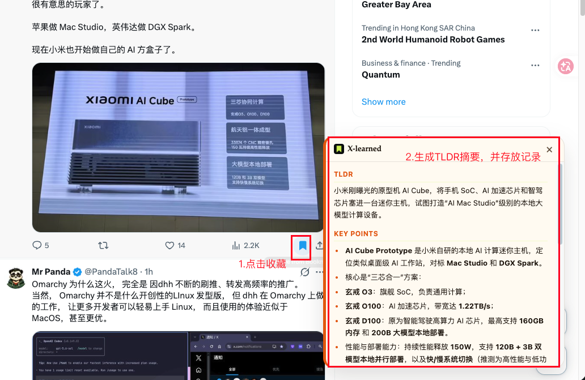

# X-learned

在 X 上点收藏，当场看到 TLDR，同时把原文和摘要写进你自己的知识库。

这是独立项目，不是 [bookmark-is-learned](https://github.com/iamzifei/bookmark-is-learned) 的换皮。产品名、界面、默认模型和远端 wiki 都按自己的工作流来。早先的实现给过参考，这里已经拆开。

## 做什么

- Chrome 扩展：在 `x.com` 收藏时弹出 TLDR 卡片
- 本地 Markdown：下载到 `Downloads/x-learned/`（或你选的文件夹）
- 远端：可选推到 `Young1108/llm_wiki` 的 `raw/x-bookmarks/`
- 默认模型：DeepSeek `deepseek-v4-flash-vision-exp`（可换成 OpenAI、Claude、Gemini、Groq、OpenRouter、xAI、Mistral、Kimi、智谱、通义千问、本地 Claude）
- 每个 Provider 单独保存 API Key，切换时不会互相覆盖

## 安装（开发版）

1. 克隆本仓库
2. 把目录拷到 Chrome 能读的路径（macOS 不要放在「文稿」里，权限会被拦）
3. `chrome://extensions` 打开开发者模式，加载已解压的扩展
4. 在弹窗里填 DeepSeek API Key，按需打开「推送到 llm_wiki」

```bash
git clone https://github.com/Young1108/x-learned.git
```

推荐加载路径：`~/x-learned-ext`（从仓库同步过去）。

## 和原参考项目的差别

| | X-learned | bookmark-is-learned |
|---|---|---|
| 产品 | 收藏即学习，接到自己的 wiki | 收藏即学到，偏本地归档 |
| 界面 | 墨绿底 + 柠檬强调，serif 标题 | X / Twitter 蓝、系统字体 |
| 默认推理 | DeepSeek | OpenAI 等 |
| 远端 | GitHub Contents → `llm_wiki` | 无 |

## 效果展示



在 `x.com` 上点击收藏按钮，立即弹出 X-learned 卡片：**TLDR 一键摘要** + **KEY POINTS 要点提炼**，同时把原文与摘要写入本地知识库。

完整使用流程见 `assets/demo.mp4`。

## 仓库结构

- `manifest.json` / `popup.*` / `content.*` / `background.js`：扩展本体
- `native-host/`：本机选文件夹保存
- `icons/`：扩展图标

API Key 只存在浏览器本地（AES-GCM），不要写进 git。

## 许可

源码在本仓库维护。参考过 iamzifei 的早期实现，界面与产品方向已分开。
